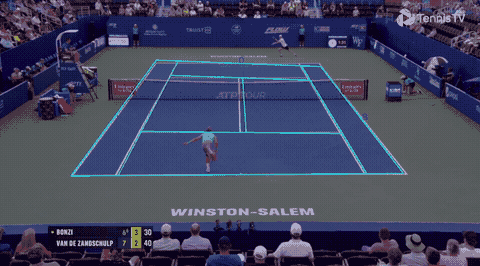

# Tennis Court Detection

Python Implementation of the paper "Robust Camera Calibration for Sport Videos using Court Models", **both Section 3 and Section 4**

Development Branch.

This branch is delicated for Section 4, as my implementation is not perfect. The projected court model will deviate bit by bit from the court lines, which affect the detection and selection of white pixels, causing a vicious cycle. The deviation can be observed after ~ 20 to 30 frames.

## Program Structure

Most of the files are shared with main branch, except the files below.

| File | Description |
| --- | --- |
| main_single_video.py | Script to run both Section 3 and Section 4 on a short video. It takes around 1 sec per frame. |

## Log

Fixed some paramters in _numerical_dfferentiation()_ of _LMA.py_ so that the projected court model will not shift drastically within a few frames.

Discovered that the matrix M contains some extremely small value (~ 1e-16) that the original value will drastically change the rmserror, and the projection matrix H = inv(M), thus causing the drastic shift observed previously.

Modified error handling of singular matrix in _LMA.py_. Previously, it will shut the program down. However, I forcefully return the most up-to-date params, which is M, so that the program can continue.

Small fix in the projection error function to match the function _LM()_  of _LMA.py_

## Insights

TLDR: fine tune the _closest_dist_ threshold in _main_video()_ of _main_single_video.py_, and both _delta_factor_ and _min_delta_ in _numerical_differentiation()_ of _LMA.py_ to improve the model

1. I observe that the most important step is the white pixel detection, which is section 3.1 of the paper. An accurate white pixel detector with as little noise as possible hugely increases the accuracy of the projection matrix. The subsequent steps are refinement of the projection matrix, using information such as distance between pixels and court lines, and rejecting impossible projection matrices. As the saying said, garbage in garbage out, the model will be accurate if the pixel detection algorithm is robust and accurate. Thus, playing around with the distance rejecting pixels too far away from the court model after inverse projection is instrumental to the model design.

2. The inverse of the projection matrix is extremely numeric sensitive. The value of the elements of the inverse can be as miniscule as 1e-16, which the index is 1/2 to the minimum of the typical float standard. Hence, playing around with the _delta_factor_ and _min_delta_ in _numerical_differentiation()_, and reduction threshold in _LA()_ of _LMA.py_ is crucial in fine-tuning the performance of the model.
